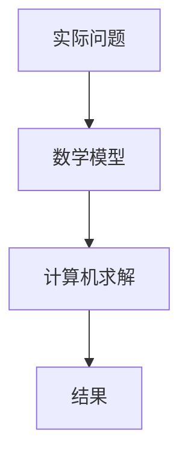

# 误差的基本概念
误差分类：
* 观察误差
* 模型误差
* 截断误差

### 截断误差(方法误差)
用有限逼近无限、用离散逼近连续、用有限步计算代替无限的计算过程，由此产生的误差称为**截断误差**或者**方法误差**。

### 误差的引入过程

A->B时：数学建模产生观察误差/模型误差。

B->C时：使用不同的计算方法，会产生不同的截断误差。

C->D时：上机计算，由此会产生舍入误差。
## 误差与误差限
### 绝对误差
$e(x)=x^{*}-x，其中x^{*}为精确值，x为x^{*}的近似值$
### 绝对误差限
$|e(x)|的上限称为x的绝对误差限，记为\varepsilon(x)$

注意：$e(x)理论上讲是唯一确定的，可能是正，也可能是负。\varepsilon(x)>0并且不唯一，当然\varepsilon(x)越小越具有参考价值。$
### 相对误差与相对误差限
$相对误差：e_r(x)=\frac{e(x)}{x^{*}}=\frac{x^{*}-x}{x^{*}}$

$相对误差限：|e_r(x)|=|\frac{e(x)}{x^{*}}|=|\frac{x^{*}-x}{x^{*}}|<=\frac{\varepsilon(x)}{|x^{*}|}=\varepsilon_r(x)$

实际计算中，分母的精确值$x$往往无法得知，通常**用近似值$x^{*}$替换。**
# 有效数字
    定义：如果近似值 x 的误差限是它的某一位的半个单位，就称它准确到这一位；若该位到 x 左边第一位非零数字共有 n 位，则称它有 n 位有效数字。

## 有效数字：由绝对误差决定
$设x的近似值x^{*}=\pm0.x_1x_2x_3x_4...x_n\times10^m，若x^{*}的绝对误差|x-x^{*}|<=\frac{1}{2}\times10^{m-n}，则称近似值x^{*}为x的n位有效数字的近似值。其中x_1，x_2，x_3，...，x_n是x^{*}的有效数字。近似值x^{*}具有n位有效数字，它精确到第n位。$
***
    1.用四舍五入得到的近似数的误差限是末位的半个单位。近似数的误差限是末位的半个单位，则有n位有效数字。因此用四舍五入得到的近似数是有效数字。
    2.在公式运算中，要先区分准确量和近似数。准确数有无穷多位有效数字.
    3.有效数字位与小数点后有多少位数无直接关系。
***
# 用微分计算函数值误差
* 要计算一元函数$f(x)在x^{*}处的函数值y^{*}=f(x)$

$已知 x^{∗}的近似值 x ，则只能计算出 y^{∗}的近似值 y=f(x)。$

$自变量误差e(x)=x^{*}-x，e(y)=y^{*}-y有何关系？$

微积分有限增量公式：$e(y)=f(x^{*})-f(x)=f'(x)(x^{*}-x)+o(x^{∗}−x)。$
其中$f'(x)(x^{*}-x)是y的微分dy，o(x^{∗}−x)是高阶小量。$
当我们舍去高阶小量$o(x^{∗}−x)$，就能得到$e(y)\approx dy=f'(x)e(x)。$

我们就能得到函数值的绝对误差$e(y)\approx dy=f'(x)e(x)$，函数值的相对误差$e_r(y)=\frac{e(y)}{y}\approx \frac{f'(x)}{f(x)}e(x)\approx \frac{f'(x)}{f(x)}xe_r(x)$

$设 u=f(x,y)是二元函数，已知自变量误差和相对误差e(x), e_r(x), e(y) 和e_r(y)。$
那么利用全微分，可得二元函数值误差$e(u)\approx du=\frac{∂u}{∂x}e(x)+\frac{∂u}{∂y}e(y)，$

$相对误差e_r(u)=\frac{e(u)}{u}\approx \frac{∂u}{∂x} \frac{x}{u}e_r(x)+\frac{∂u}{∂y}\frac{y}{u}e_r(y)$
# 和差积商的误差
$令x^{∗}\approx x,y^{∗}\approx y,则$

$x^{*}\mp y^{*}，x^{*}\times y^{*}\approx x\times y，\frac{x^{*}}{y^{*}} \approx \frac{x}{y}$

若已知$e(x)，e_r(x)和e(y)，e_r(y)，则有：$

$e(x\mp y) = e(u)\approx e(x)\approx e(y)$

$e_r(x\mp y)\approx \frac{x}{x\mp y}e_r(x)+\frac{y}{x\mp y}e_r(y)$

**一定要注意：不能大乘数和小除数！！！**

    大乘数、小除数：当乘数 x 的绝对值很大或除数 y 接近零时，计算结果的绝对误差可能很大。
⬇⬇⬇
##### ！！！注意！！！
差的相对误差：x和y很接近时，|x-y|很小，除数$|\frac{x}{x-y}|这种会很大$，导致相对误差会很大。

近似数乘除法的相对误差不会迅速传播：
$e_r(xy)\approx e_r(x)+e_r(y)$

$e_r(\frac{x}{y}) \approx e_r(x)-e_r(y)$

**近似数乘除法的||绝对误差||要注意：**

$e(xy)\approx ye(x)+xe(y)，e(\frac{x}{y})\approx \frac{1}{y}e(x)-\frac{x}{y^2}e(y)$
***